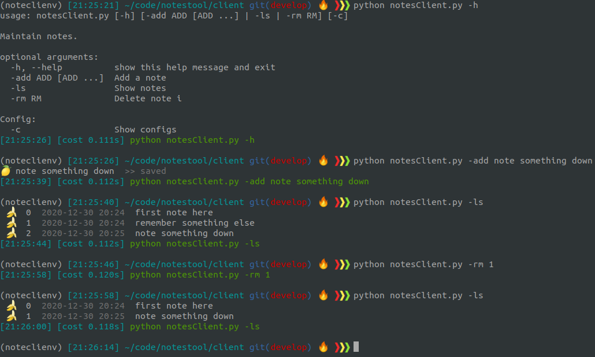

# Notes shell tool  

Cmd line notes cli tool and database backend.

  

## Start  

1. Set `.env` variables  
2. Backend daemon:  
```  
docker-compose up --build -d  
```  

3. Shell client:  
```  
pipenv shell  
pipenv install  
python notesClient.py <cmd>  
```

### Shell alias  
Create alias in ~/.zshrc or ~/.bashrc
```
alias note='python <PWD>/client/notesClient.py'
```

## Build with  
* Docker  
* MongoDB  
* NodeJs/express  
* Python 3.7.0  
* Pipenv/virtualenv  

## Project structure  
```
├── backend
│   ├── backend.js
│   ├── Dockerfile
│   ├── package.json
│   └── package-lock.json
├── client
│   ├── noteclienv
│   │   ├── bin
│   │   ├── lib
│   │   └── pyvenv.cfg
│   ├── notesClient.py
│   ├── note.sh
│   ├── Pipfile
│   ├── Pipfile.lock
│   └── requirements.txt
├── docker-compose.yml
├── docs
│   └── notestoolscreenshot.png
├── makefile
└── README.md
```
